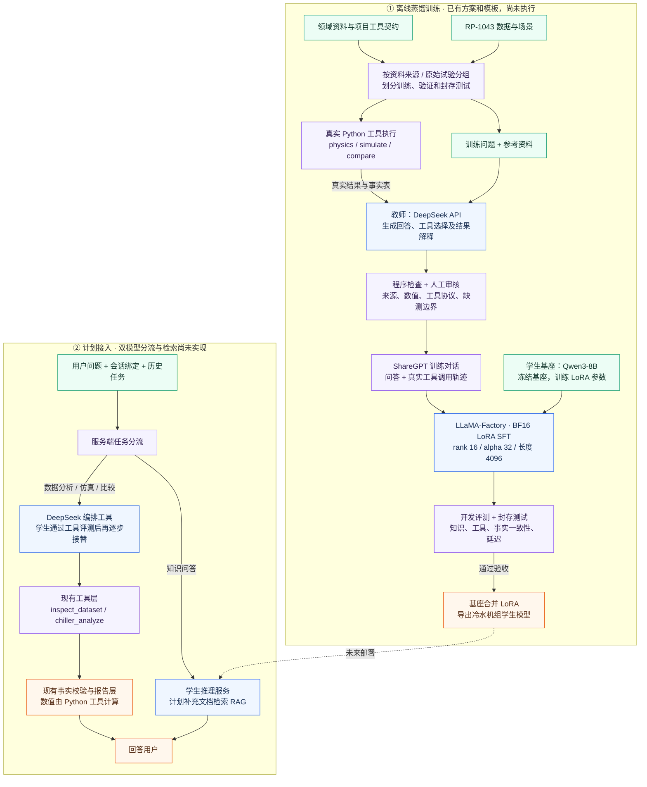

# 冷水机组模型蒸馏架构

依据 docs/chiller_distillation_2026-11-02.md 与 examples/distillation 配置。训练和双模型接入均处于规划阶段；工具与事实报告层已存在。

```mermaid
flowchart TB
    subgraph offline["① 离线蒸馏训练 · 已有方案和模板，尚未执行"]
        direction TB
        docs["领域资料与项目工具契约"] --> split["按资料来源 / 原始试验分组<br/>划分训练、验证和封存测试"]
        rp["RP-1043 数据与场景"] --> split
        split --> prompt["训练问题 + 参考资料"]
        split --> tools["真实 Python 工具执行<br/>physics / simulate / compare"]
        prompt --> teacher["教师：DeepSeek API<br/>生成回答、工具选择及结果解释"]
        tools -->|真实结果与事实表| teacher
        teacher --> audit["程序检查 + 人工审核<br/>来源、数值、工具协议、缺测边界"]
        audit --> dataset["ShareGPT 训练对话<br/>问答 + 真实工具调用轨迹"]
        dataset --> sft["LLaMA-Factory · BF16 LoRA SFT<br/>rank 16 / alpha 32 / 长度 4096"]
        base["学生基座：Qwen3-8B<br/>冻结基座，训练 LoRA 参数"] --> sft
        sft --> eval["开发评测 + 封存测试<br/>知识、工具、事实一致性、延迟"]
        eval -->|通过验收| export["基座合并 LoRA<br/>导出冷水机组学生模型"]
    end
    subgraph online["② 计划接入 · 双模型分流与检索尚未实现"]
        user["用户问题 + 会话绑定 + 历史任务"] --> route["服务端任务分流"]
        route -->|知识问答| student["学生推理服务<br/>计划补充文档检索 RAG"]
        route -->|数据分析 / 仿真 / 比较| cloud["DeepSeek 编排工具<br/>学生通过工具评测后再逐步接替"]
        cloud --> runtime["现有工具层<br/>inspect_dataset / chiller_analyze"]
        runtime --> facts["现有事实校验与报告层<br/>数值由 Python 工具计算"]
        student --> answer["回答用户"]
        facts --> answer
    end
    export -.->|未来部署| student
    classDef input fill:#ecfdf5,stroke:#059669,color:#12352b
    classDef model fill:#eff6ff,stroke:#2563eb,color:#172d50
    classDef process fill:#f5f3ff,stroke:#7c3aed,color:#332252
    classDef output fill:#fff7ed,stroke:#ea580c,color:#542c15
    class docs,rp,prompt,base,user input
    class teacher,sft,student,cloud model
    class split,tools,audit,dataset,eval,route,runtime process
    class export,facts,answer output
```
