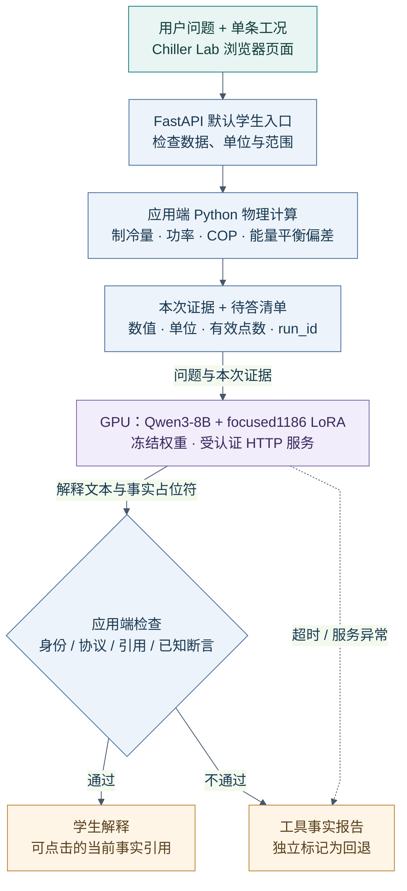

# 默认学生分析架构

当前默认入口先执行Python，再请求学生解释。外部模型入口由用户显式选择，见架构说明。

```mermaid
%%{init: {"theme":"base","themeVariables":{"fontFamily":"Microsoft YaHei, Arial, sans-serif","fontSize":"18px","primaryColor":"#EDF3FA","primaryBorderColor":"#426B9D","primaryTextColor":"#193952","lineColor":"#44576A","actorBkg":"#EDF3FA","actorBorder":"#426B9D","actorTextColor":"#193952","signalColor":"#44576A","signalTextColor":"#193952","labelBoxBkgColor":"#F6F9FC","labelBoxBorderColor":"#8094A8"},"flowchart":{"wrappingWidth":360,"nodeSpacing":40,"rankSpacing":35,"curve":"linear"},"sequence":{"mirrorActors":false}}}%%
flowchart TB
    input["用户问题 + 单条工况<br/>Chiller Lab 浏览器页面"]
    api["FastAPI 默认学生入口<br/>检查数据、单位与范围"]
    physics["应用端 Python 物理计算<br/>制冷量 · 功率 · COP · 能量平衡偏差"]
    evidence["本次证据 + 待答清单<br/>数值 · 单位 · 有效点数 · run_id"]
    student["GPU：Qwen3-8B + focused1186 LoRA<br/>冻结权重 · 受认证 HTTP 服务"]
    gate{"应用端检查<br/>身份 / 协议 / 引用 / 已知断言"}
    report["学生解释<br/>可点击的当前事实引用"]
    fallback["工具事实报告<br/>独立标记为回退"]
    input --> api --> physics --> evidence
    evidence -->|"问题与本次证据"| student
    student -->|"解释文本与事实占位符"| gate
    gate -->|"通过"| report
    gate -->|"不通过"| fallback
    student -.->|"超时 / 服务异常"| fallback
    classDef source fill:#E8F5F2,stroke:#147D78,color:#123D3A
    classDef code fill:#EDF3FA,stroke:#426B9D,color:#193952
    classDef model fill:#F1EDFA,stroke:#7860A6,color:#3A285D
    classDef result fill:#FFF5E6,stroke:#B98033,color:#59411E
    class input source
    class api,physics,evidence,gate code
    class student model
    class report,fallback result
```

[PNG预览](system-architecture.png) · [源码](system-architecture.mmd)
